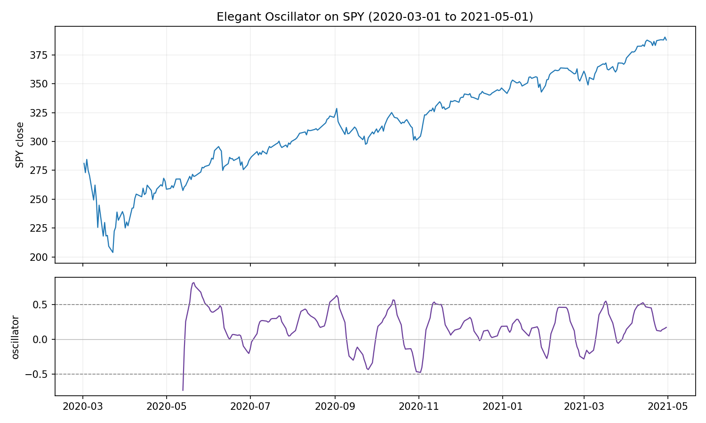
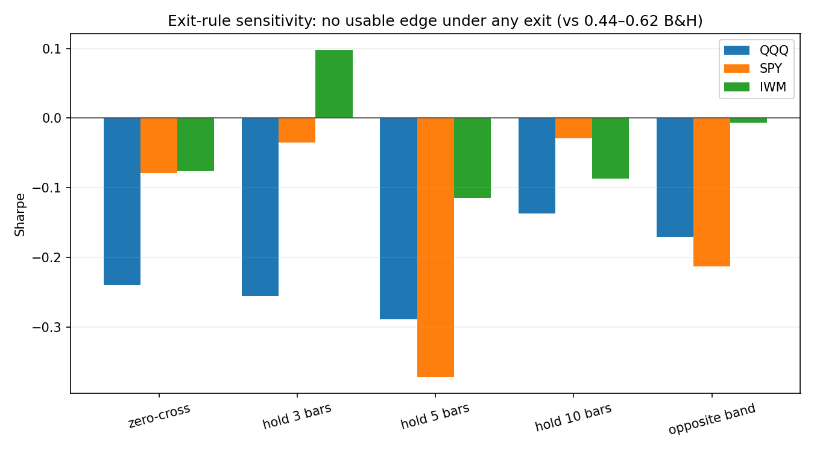
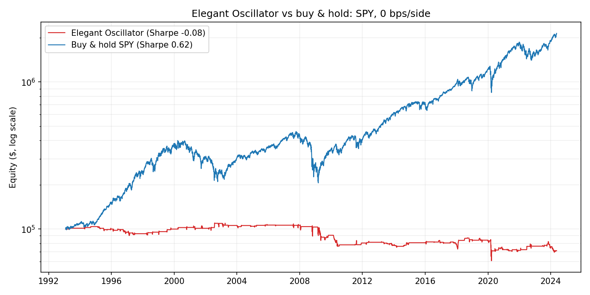

# The Inverse Fisher Transform: does Ehlers' Elegant Oscillator have an edge?

John Ehlers introduced the **Elegant Oscillator** (TASC, Feb 2022), built on the
**Inverse Fisher Transform** of a normalised price derivative and smoothed by his
two-pole SuperSmoother. [The Financial Hacker](https://financial-hacker.com/the-inverse-fisher-transform/)
tested it as a mean-reversion signal on SPY and reported **5 of 7 winning trades,
profit factor above 6** , over a single 14-month window (Mar 2020 – May 2021).

Seven trades on one hand-picked window is not evidence. This project reimplements
the indicator from Ehlers' C/Zorro code in plain Python and asks the question the
original skips: **is there a repeatable edge once you stop cherry-picking?** Full
history, three liquid ETFs, transaction costs, and an explicit account of the one
rule the source leaves undefined.

**Verdict: no.** The signal is faithfully reproduced but does not generalise —
negative return and Sharpe on every instrument over full history, far below
buy-and-hold, and it is not a cost problem.

## The indicator

Translated directly from Ehlers' published code:

- **Inverse Fisher Transform** `(e^{2x} − 1) / (e^{2x} + 1)` — squashes an
  unbounded input into (−1, 1), sharpening extremes (it is `tanh`).
- **SuperSmoother** — a two-pole Butterworth low-pass filter, low lag.
- **Elegant Oscillator** — normalise a 2-bar price derivative by its rolling RMS,
  push it through the Inverse Fisher Transform, then SuperSmooth it:

```
deriv  = close − close[-2]
rms    = sqrt( mean(deriv², 50) )
osc    = SuperSmoother( InverseFisher(deriv / rms), 20 )
```



Ehlers' signal: a **peak above +0.5** means over-extended up (expect reversion
down → short); a **valley below −0.5** means over-extended down (→ long).

## The one thing the source leaves undefined: the exit

The published Zorro code calls `enterLong()` / `enterShort()` with **no exit
rule**. On multi-year data that degenerates: the 2020–21 window has **seven peaks
and zero valleys**, so a literal stop-and-reverse system just stays short a rising
market, resulting in one trade, a −96% drawdown, and a meaningless test.

A signal with no exit is not a strategy. The default here is to **close when the
oscillator reverts back through zero**, staying flat between trades. **The exit is
ours, not Ehlers'** — so the verdict must not depend on it. It is also why the
trade counts here (6 in the window) match the article's seven signals while the
outcome does not.

To check that dependence, the exit rule is a parameter and gets swept across five
choices on all three ETFs (`exit_sensitivity`): revert-through-zero, a fixed hold
of 3 / 5 / 10 bars, and ride-to-the-opposite-band.



The verdict holds: **14 of the 15 instrument × exit combinations post a negative
Sharpe**, and the single exception — IWM on a 3-bar hold, Sharpe **0.10** — is
noise next to buy-and-hold's 0.44. There is no exit rule that turns this signal
into a usable edge, so the "no edge" conclusion is not an artifact of the one we
picked.

## Results

### The article's window vs the full history (SPY)

| | CAGR | Sharpe | Max DD | Win rate | Trades |
|---|---|---|---|---|---|
| Article window (2020-03 → 2021-05) | -3.9% | -0.38 | -7.9% | 33% | 6 |
| Full history (1993 → 2024) | -1.1% | -0.08 | -44.7% | 54% | 108 |

Even reproducing the exact window, the honest implementation is a loser (2 of 6
winners, not 5 of 7). The article's headline rested on the undefined exit and a
tiny sample.

### Across three ETFs, full history, no costs

| Symbol | Strategy CAGR | Strategy Sharpe | Max DD | Exposure | Win rate | Trades | Buy & hold CAGR | B&H Sharpe |
|---|---|---|---|---|---|---|---|---|
| QQQ | **-4.1%** | **-0.24** | -68% | 21% | 52% | 94 | +9.7% | 0.48 |
| SPY | **-1.1%** | **-0.08** | -45% | 18% | 54% | 108 | +10.3% | 0.62 |
| IWM | **-1.4%** | **-0.08** | -47% | 16% | 62% | 84 | +7.9% | 0.44 |

Every instrument loses money and posts a negative Sharpe, against a buy-and-hold
that compounds at ~8–10% a year. Note the **win rate is above 50%** everywhere —
the signal is better than a coin flip on *direction* — yet it still loses, because
the payoff is asymmetric: wins are cut at the zero-cross while losers run.



### It is not a cost problem (SPY)

| Cost | CAGR | Sharpe | Trades |
|---|---|---|---|
| 0 bps | -1.1% | -0.08 | 108 |
| 1 bps | -1.1% | -0.08 | 108 |
| 2.5 bps | -1.2% | -0.09 | 108 |
| 5 bps | -1.2% | -0.10 | 108 |
| 10 bps | -1.4% | -0.12 | 108 |

Turnover is low, so costs barely move the result. The strategy is unprofitable at
**zero** cost — the problem is the absence of an edge, not friction.

## Conclusion

The Elegant Oscillator is a well-constructed *indicator* — the DSP is sound and
the reproduction is faithful. But as a standalone mean-reversion *signal* it has
no edge on broad US equity ETFs: negative expectancy over 25–31 years on three
instruments, comfortably beaten by doing nothing. The published "profit factor
above 6" is what a small sample on a single favourable window looks like. This is
the ordinary fate of most single-indicator rules, and the reason out-of-sample,
multi-instrument testing exists.

## Data and reproducibility

Prices (QQQ, SPY, IWM; split/dividend-adjusted) are committed under `data/` so
every number reproduces from a clone. Yahoo revises its adjusted history and
rate-limits downloads, so a repo that re-downloads would drift.

## Usage

```bash
python -m venv .venv && source .venv/bin/activate
pip install -r requirements.txt

python elegant_oscillator.py --replicate --plot   # window vs full history, + plots
python elegant_oscillator.py --symbol QQQ
```

Tables print and write to `Results/`; `--plot` saves the indicator chart and the
equity-vs-buy-and-hold curves.

## Limitations

- Long-only-vs-short reversal on broad ETFs; no per-name universe, no shorting
  frictions or borrow cost modelled.
- The exit rule is a modelling choice, so it is swept (zero-cross, 3/5/10-bar
  holds, opposite band); the negative result survives all of them. Other exits
  are conceivable, but would have to overturn 14 of 15 negative instrument × exit
  cases.
- Daily bars only. Ehlers' filters are often used intraday, which is not tested
  here.
